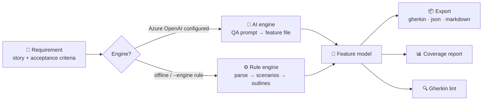

# AI Test Case & Gherkin Generator

Turn product requirements and user stories into ready-to-run **Gherkin feature files** —
through a CLI or a web UI — with an AI engine (Azure OpenAI) and an offline rule-based
engine that works with no API key.

## How it works



**Step by step:**

1. **Write your requirement** — a markdown file with a `As a / I want / So that` story
   plus `Acceptance Criteria` bullets (or paste it into the web UI).
2. **Score it** (`--quality`) — the analyzer grades testability 0–100 and tells you
   exactly what to fix before you generate anything.
3. **Pick an engine** — `auto` uses Azure OpenAI when your key is configured,
   otherwise the offline rule engine. Override with `--engine ai|rule`.
4. **Generate** — each criterion becomes a `Scenario`; `When ... then ...` lines are
   split into steps; value lists like `(admin, user, guest)` become
   `Scenario Outlines` with `Examples` tables; negative scenarios
   (validation, unauthorized access, not found) are added automatically.
5. **Execute** (`--execute`) — scenarios compile to typed browser actions and run
   headlessly in Chromium against your app: per-step timing, screenshots on failure.
   `--codegen` emits the whole suite as a standalone Playwright module.
6. **Verify** — `--report` shows scenario coverage per requirement,
   `--lint` catches structural problems, `--dedup` flags copy-paste scenarios.

## Generate → Execute

The point where this stops being a text generator: generated scenarios compile
into **typed browser actions** (`goto`/`fill`/`click`/`expect_*`) and run for real
in headless Chromium.

```bash
# Terminal 1: start the demo target app (a real login app)
python demo-app/app.py

# Terminal 2: generate AND execute
python -m src.cli -i examples/login_story.md --engine rule --execute
```

Real run output:

```
Compiled 4/5 scenarios to browser actions [demo-login-app]
Execution: 4/4 scenarios passed (1225ms total)

  ✅ AC1 - the user submits valid credentials, then they are taken to the dashboard [332ms]
      ✓ open login page (93ms)
      ✓ fill valid email (104ms)
      ✓ fill valid password (9ms)
      ✓ click log in (87ms)
      ✓ expect dashboard url (35ms)
      ✓ expect welcome visible (4ms)
  ✅ AC2 - the user submits an invalid password 3 times, then the account is temporarily locked [432ms]
  ✅ AC3 - An error is shown when the email format is invalid [271ms]
  SKIP AC4 - Sessions expire after 30 minutes of inactivity (no compilable browser actions for target app)
  ✅ Validation - invalid input is rejected [190ms]
```

Notes from real execution:
- The 5th scenario is **honestly skipped** — a 30-minute session timeout can't be
  validated in a quick run, and the tool says so instead of faking it.
- An early run caught the browser's native `type="email"` validation blocking form
  submission before the app's own validation could run — the kind of thing you only
  learn by executing.
- Failures capture screenshots to `screenshots/` automatically.

```bash
# Emit the suite as a standalone runnable Playwright module instead
python -m src.cli -i examples/login_story.md --codegen test_login.py
pytest test_login.py
```

Point it at your own app by adding its selectors and test data to the
target config in `src/actions.py` (see `DEMO_TARGET`).

## Real-world evaluation

The quality scorer was run over **30 live feature requests** from
`microsoft/vscode` (public GitHub API, no auth) via `eval/real_world_quality.py`:

- Average requirement quality: **66/100**
- **16/30** had no testable acceptance criteria at all
- 4/30 used vague, untestable language

That's the gap this tool closes: it scores the requirement *first*, tells the
author what to fix, then generates the tests.

## Web UI

```bash
pip install -r requirements.txt
python app.py
```

Open http://127.0.0.1:5000 — paste a story, choose engine and format, and get the
generated file in the browser with coverage and lint results, plus a download button.

## CLI

```bash
# Auto engine, Gherkin output
python -m src.cli -i examples/login_story.md -o login.feature

# Score the requirement first, then generate with coverage + lint
python -m src.cli -i examples/login_story.md --engine rule --quality --report --lint -o login.feature

# Detect near-duplicate scenarios and generate pytest-bdd stubs
python -m src.cli -i examples/login_story.md --dedup --stubs test_login_steps.py -o login.feature

# Offline rule engine, JSON catalog
python -m src.cli -i examples/login_story.md --engine rule --format json -o login.json

# Markdown test plan
python -m src.cli -i examples/login_story.md --format markdown -o plan.md

# Batch: convert a folder of stories
python -m src.cli -i stories/ -o features/

# Pipe via stdin
cat mystory.md | python -m src.cli --engine rule
```

Input format:

```markdown
# Password reset

As a registered user, I want to reset my password,
so that I can regain access to my account.

Acceptance Criteria:
- When the user submits a registered email, then a reset link is emailed
- An error is shown for unregistered email addresses
- Reset links expire after 60 minutes
```

See [`examples/login.feature`](examples/login.feature) for generated output.

## Features

### Generation
- 🤖 **AI engine** — Azure OpenAI with a QA-engineer system prompt
- ⚙️ **Offline rule engine** — zero dependencies, zero network calls
- 🧬 **Scenario Outlines** — parenthesized value lists become `Examples` tables
- 🛡️ **Negative scenarios** — validation, auth, and not-found cases auto-added

### Quality engineering
- 🎯 **Requirement quality scoring** — grades the story 0–100 (A–F) before generating:
  detects vague untestable language ("fast", "user-friendly"), missing actors/goals,
  compound criteria, and criteria with no observable outcome — each finding ships with a fix suggestion
- 🔍 **Near-duplicate detection** — TF-IDF + cosine similarity flags copy-paste scenarios
  so they can be merged into Scenario Outlines
- 📊 **Coverage reports** — positive/negative/outline counts per requirement
- ✅ **Gherkin lint** — missing steps, duplicates, empty scenarios

### From spec to executable suite
- 🧪 **pytest-bdd stub generation** (`--stubs`) — turns the feature file into runnable
  step-definition skeletons: shared steps deduped, `<placeholders>` become regex parsers
- 📦 **Multi-format export** — Gherkin, JSON catalog, Markdown test plan
- 🌐 **Web UI** — score, generate, preview, and download in the browser
- 📁 **Batch mode** — convert whole folders of stories at once

## Setup

```bash
git clone https://github.com/dharshuadhi/ai-gherkin-generator.git
cd ai-gherkin-generator
pip install -r requirements.txt
cp .env.example .env   # fill in Azure OpenAI values for the AI engine
```

## Tests

```bash
python -m unittest discover -s tests -v
```

## Project structure

```
app.py            Flask web UI
demo-app/         real target app for the generate->execute loop (login, lockout, reset)
eval/             real-world evaluation scripts (live GitHub data)
src/
  cli.py          argument parsing, engine selection, batch mode, execute/codegen
  actions.py      action compiler: Gherkin steps -> typed browser actions
  codegen.py      standalone runnable Playwright module generator
  runner.py       headless Chromium executor (timings, screenshots, reports)
  ai_engine.py    Azure OpenAI client + generation
  rule_engine.py  offline parser + structured Feature model + Gherkin renderer
  quality.py      requirement quality scoring (vague language, structure, testability)
  similarity.py   TF-IDF near-duplicate scenario detection
  stubs.py        pytest-bdd step-definition stub generator
  formats.py      JSON catalog + Markdown test plan renderers
  coverage.py     coverage analysis + report
  lint.py         Gherkin structural lint
  prompts.py      system prompt for the AI engine
docs/             browser demo (GitHub Pages): generator + quality scorer in JS
examples/         sample requirement + generated feature file
tests/            27 unit tests incl. live headless execution
```

## License

MIT — see [LICENSE](LICENSE).
